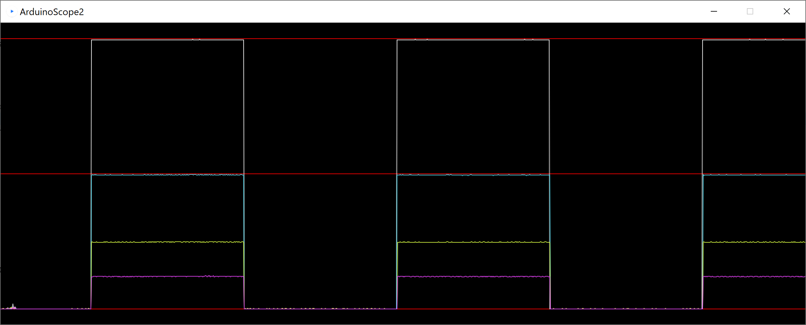
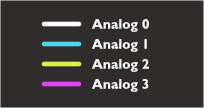

# Arduino Scope 2
A simple 4 channel Arduino/Processing oscilloscope

Modified from Arduino code presented in 
https://randomnerdtutorials.com/arduino-poor-mans-oscilloscope/
and Processing code originally by Sofian Audry for their project Accrochages
https://sofianaudry.com/works/accrochages/

The Arduino Scope 2 allows for viewing up to 4 analog signals at the same time. This has been tested on an Arduino UNO and Processing 4.2.  

## Hardware

- Arduino compatible microcontroller
- 5x jumper wires to be used as probes

## Software

- Relatively current [Arduino IDE](https://www.arduino.cc/en/software) (tested on 1.8.19)
- Relatively current [Processing IDE](https://processing.org/download) (tested on 4.2)

## Installation

- open ArduinoScope2.ino in Arduino IDE and load onto your microcontroller
- open ArduinoScope2.pde in Processing and press play

## Measuring 

- Use a jumper to connect the microcontroller AREF pin to the circuit you are measuring's positive voltage
- Connect jumpers from Analog 0-3 to your circuit test points
- Connect any unused Analog ins to GND

### Color key

## Notes and caveats

- Signals should not exceed the range 0-5V for Arduino UNO or the pin voltage capacity of which ever microcontroller you are using.
- Do not depend on this for accurate readings of voltage or timing. It purely a simple visualizer for testing purposes.
- If you are measuring the output of another microcontroller attached to your computer you may need to adjust the Serial port number in the Processing code.
- If you are not using all 4 Analog ins any unconnected pins will show the value of the lowest value. You can jump those pins to GND if this bothers you.